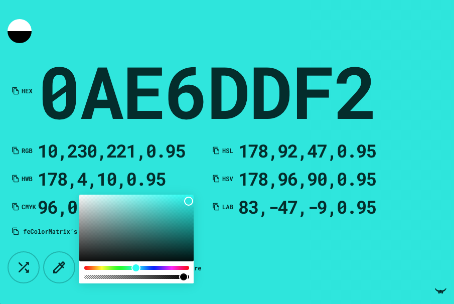

## yet another color converter

![][github-actions-lighthouse-image]
[![Dependencies][david-image]][david-url]
[![Dev Dependencies][david-dev-image]][david-dev-url]

Convert HEX, RGB, HSL, HWB, HSV, CMKYK, LAB color models plus feColorMatrix’s values.

https://noeldelgado.github.io/yacc/



### Development
Start server on port 3000 with livereload watching files on the `src` folder

```sh
npm install
npm start
```

#### SVG sprite
If you need to add a new `.svg` files to the svg sprite located after the `body` tag:

- Place your `.svg`’s files on the `src/assets/svg` folder
- Make sure you have `svg-sprite` installed, e.i.: `npm i -g svg-sprite`
- Run npm script `npm run svg`
  - That should generate a new file at `src/assets/svg-sprite-symbol/svg/sprite.symbol.svg` (ignored by `.gitignore`’s rule)
- Copy the contents of that file and replace the `svg` line after the `body` 🙈

### Build
To minify the `build/{js,css}/main.<ext>` files. Make sure you have `uglify` installed, e.i.: `npm i -g uglify` and then

```sh
npm run build
```

[github-actions-lighthouse-image]: https://github.com/noeldelgado/yacc/workflows/Lighthouse/badge.svg
[david-image]: https://img.shields.io/david/noeldelgado/yacc.svg
[david-url]: https://david-dm.org/noeldelgado/yacc
[david-dev-image]: https://img.shields.io/david/dev/noeldelgado/yacc.svg
[david-dev-url]: https://david-dm.org/noeldelgado/yacc?type=dev